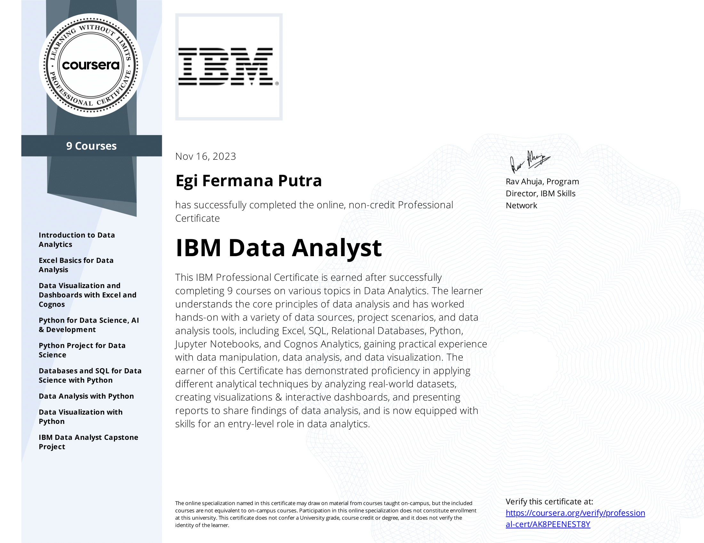

# IBM Data Analyst Professional Certificate

## Overview
The IBM Data Analyst Professional Certificate is a comprehensive program designed to equip individuals with the skills and knowledge necessary to excel in the field of data analysis. This certification is offered by IBM, a global leader in technology and innovation.

## Table of Contents
1. About the Certificate
2. Skills Acquired
3. Course Structure
4. Prerequisites
5. How to Enroll
6. Certification Completion

## About the Certificate
The IBM Data Analyst Professional Certificate is a series of courses and hands-on labs that cover key aspects of data analysis, including data visualization, statistical analysis, and data manipulation. The program is suitable for beginners and intermediate-level professionals looking to enhance their data analytics skills.

## Skills Acquired
Upon completion of the IBM Data Analyst Professional Certificate, participants will gain proficiency in:

* Data Cleaning and Transformation
* Exploratory Data Analysis
* Data Visualization using tools like Tableau and Matplotlib
* Statistical Analysis and Hypothesis Testing
* SQL for Data Analysis
* Python and Jupyter Notebooks
* Machine Learning Fundamentals

## Course Structure
The certificate program is divided into several modules, each focusing on a specific aspect of data analysis. Participants can progress at their own pace and access a variety of learning resources, including video lectures, hands-on labs, and quizzes.

For detailed information on each course, please refer to the official IBM Data Analyst Professional Certificate page.

## Prerequisites
To successfully complete the IBM Data Analyst Professional Certificate, participants should have:

* Basic understanding of data concepts
* Familiarity with spreadsheet software (e.g., Microsoft Excel, Google Sheets)
* No prior programming experience required, but it can be beneficial

## How to Enroll
To enroll in the IBM Data Analyst Professional Certificate program, follow these steps:

1. Visit the IBM Data Analyst Professional Certificate page.
2. Create an IBM account or log in if you already have one.
3. Follow the instructions to enroll in the program.

## Certification Completion
Upon successful completion of all the required courses and assessments, participants will receive the IBM Data Analyst Professional Certificate. This industry-recognized credential demonstrates proficiency in data analysis and enhances career prospects in various fields.
